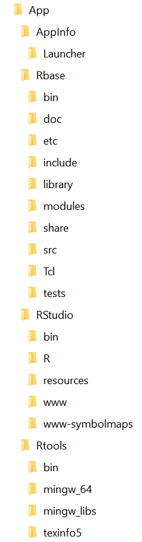

# REnPortable
A portable R environment for Windows

## Introduction
REnPortable is a portable 64-bit R environment for Windows. It was put together using the [PortableApps.com](https://portableapps.com) launcher but is not endorsed by and does not comply with PortableApps.com requirements.

Please note that to use REnPortable you need to supply your own 64-bit copy of [R(base)](https://cloud.r-project.org/), [Rtools](https://cloud.r-project.org/), [RStudio](https://www.rstudio.com/products/rstudio/download/) (Open Source Edition). REnPortable was tested with R v3.5.1, Rtools v3.4, and RStudio Desktop Open Source v1.1.453 on a Windows 10 (x64) machine. No support is offered for any of these programs -- please use the relevant support pages.

The reason for putting together REnPortable was to have a complete, portable R environment to learn R and [RStan](http://mc-stan.org/). Therefore, all the preliminary work is complete to install the [RStan for Windows](https://github.com/stan-dev/rstan/wiki/Installing-RStan-on-Windows) packages into REnPortable. 

## Getting started
1. The size of the 64-bit versions of R, RStudio, and Rtools together is approximately 1.1 GB. If you want to add other R packages you will need room for these too. For example, RStan plus dependencies adds another 350 MB (total ~1.5 GB on disk). You could save 500 MB by excluding Rtools but REnPortable has not been tested with out Rtools and RStan will not work without Rtools.
1. You can download the REnPortable zip file and unzip to any place on a Windows 64-bit machine, USB, or external drive. 
1. If you have installed 64-bit versions of R, Rtools, or RStudio, you can copy the program files for each into the appropriate folders in the Apps directory (see Folder structure below).
1. If you have not installed 64-bit versions of R and Rtools you will need to install them (choose to install the 64-bit versions only), copy the program files to the correct folders in REnPortable and then uninstall R and Rtools. RStudio Desktop can be downloaded as a zip file and unzipped into the appropriate RStudio folder.
1. Launch REnPortable.exe

**Note:** Every time you start REnPortable, RStudio will ask you for the version of R you wish to use. Please select the version of R that is in `...\REnPortable\App\Rbase` (see below); if you do not have R installed, this should be the only version listed. This is a behaviour of RStudio and cannot be change (AFAIK).

## Folder structure
### App
1. **AppInfo** files for portability of REnPortable, there is no reason to edit these unless you know what you are doing
1. **Rbase** where to put the R program files (and updated versions of R)
1. **RStudio** where to put the RStudio program files (and updated versions of RStudio)
1. **Rtools** where to put the Rtools program files (and updated versions of Rtools)

This what the correct App folder structure should look like:

### Data
1. **R** various R files that are copied to your Windows profile under `\Users\[username]\AppData\Roaming\R` when you start REnPortable and then deleted when you close REnPortable
1. **RBase** copy of the `Renviron.site` file that tells R where the working directory and user library are located, edit at your own risk
1. **RData** the working directory\folder for R and RStudio, e.g. `R_USER` and `HOME`
1. **RLibrary** R packages are added to this folder to separate them from the main R program, i.e. `R_LIBS_USER`
1. **RStudio** various RStudio files that are copied to your Windows profile under `\Users\[username]\AppData\Roaming\RStudio` when you start REnPortable and then deleted when you close REnPortable
1. **RStudio-Desktop** various RStudio files that are copied to your Windows profile under `\Users\[username]\AppData\Local\RStudio-Desktop` when you start REnPortable and then deleted when you close REnPortable
1. **Settings** a registry file to tell RStudio where to find R (added on start and deleted on close) and a file that has the previous place REnPortable was run from (required to maintain portability)
1. **Temp** temporary files for R/RStudio (I haven't seen anything saved there yet but who knows?)

### Other
Various files for portability, there is no reason to edit these unless you know what you are doing
